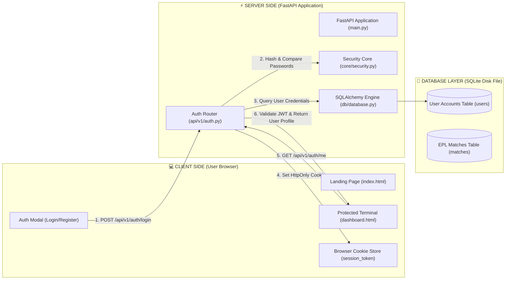

# Architecture Map - DataWrangler.AI

This document details the system architecture, component interaction topology, client/server boundaries, and audit logging standards for **DataWrangler.AI**.

---

## 🌐 1. Client-Side vs. Server-Side Execution Boundaries

```
┌──────────────────────────────────────────────────────────────────────────────────┐
│ 💻 CLIENT SIDE (User Browser) - Untrusted Execution Environment                  │
│  - Runs HTML5, CSS3, and JavaScript in the user's web browser.                    │
│  - Displays landing page (`index.html`), login/register modal, and dashboard UI. │
│  - Stores the `HttpOnly` `session_token` cookie (inaccessible to JS script).     │
└────────────────────────────────────────┬─────────────────────────────────────────┘
                                         │
                                         │ HTTP Request (JSON / Cookies)
                                         ▼
┌──────────────────────────────────────────────────────────────────────────────────┐
│ ⚡ SERVER SIDE (FastAPI + Python Backend) - Trusted Execution Environment        │
│  - Runs `uvicorn` / FastAPI server on host/cloud machine (`main.py`).             │
│  - Validates request payloads using Pydantic schemas (`schemas/auth.py`).        │
│  - Hashes/verifies passwords securely with `bcrypt` (`core/security.py`).        │
│  - Enforces route access permissions (`api/v1/auth.py`).                         │
└────────────────────────────────────────┬─────────────────────────────────────────┘
                                         │
                                         │ SQLAlchemy ORM Queries
                                         ▼
┌──────────────────────────────────────────────────────────────────────────────────┐
│ 💾 DATABASE LAYER (SQLite File Database)                                         │
│  - Persistent database on server disk (`epl_quant.db`).                          │
│  - Stores encrypted user records (`users` table) & EPL match data (`matches`).   │
└──────────────────────────────────────────────────────────────────────────────────┘
```

---

## 📐 2. System Component Interaction Diagram



---

## 🔄 3. Authentication Request Flow Sequence

```mermaid
sequenceDiagram
    autonumber
    actor User as Client (Browser)
    participant AuthAPI as Backend Auth Endpoint
    participant Security as Security Module
    participant DB as SQLite Database
    participant Dashboard as Protected Dashboard

    Note right of User: 1. Authentication Phase (Client to Server)
    User->>AuthAPI: POST /api/v1/auth/login
    AuthAPI->>DB: Query user by email
    DB-->>AuthAPI: User record (with hashed_password)
    AuthAPI->>Security: Verify password hash
    Security-->>AuthAPI: Password valid
    AuthAPI->>Security: Generate JWT session token
    Security-->>AuthAPI: Signed JWT token
    AuthAPI-->>User: HTTP 200 OK + Set-Cookie: session_token=JWT; HttpOnly

    Note right of User: 2. Protected Navigation Phase
    User->>Dashboard: Redirect to /dashboard
    Dashboard->>AuthAPI: GET /api/v1/auth/me (Cookie automatically attached)
    AuthAPI->>Security: Decode & verify JWT session token
    Security-->>AuthAPI: Valid token payload (user_id)
    AuthAPI->>DB: Fetch user profile metadata
    DB-->>AuthAPI: Profile data
    AuthAPI-->>Dashboard: HTTP 200 OK (User Profile)
    Dashboard-->>User: Render Sports Terminal Workspace
```

---

## 🗂️ 4. Directory & Module Mapping Table

| File Path | Boundary | Responsibility |
| :--- | :--- | :--- |
| [app/static/index.html](file:///Users/manuelnavas/Documents/Google-Antigravity/Getting-started/app/static/index.html) | **Client** | Public landing page, interactive scenario preview demo, and login/register modal UI. |
| [app/static/dashboard.html](file:///Users/manuelnavas/Documents/Google-Antigravity/Getting-started/app/static/dashboard.html) | **Client** | Protected sports terminal interface. Verifies session cookie on load via `/api/v1/auth/me`. |
| [app/main.py](file:///Users/manuelnavas/Documents/Google-Antigravity/Getting-started/app/main.py) | **Server** | Server entrypoint: Initializes FastAPI ASGI app, mounts static file handlers, and sets up startup database auto-creation. |
| [app/api/v1/auth.py](file:///Users/manuelnavas/Documents/Google-Antigravity/Getting-started/app/api/v1/auth.py) | **Server** | Auth endpoints (`/register`, `/login`, `/logout`, `/me`). Validates credentials and manages `HttpOnly` cookies. |
| [app/core/security.py](file:///Users/manuelnavas/Documents/Google-Antigravity/Getting-started/app/core/security.py) | **Server** | Hashes passwords with `bcrypt` and signs/verifies JWT tokens. |
| [app/core/config.py](file:///Users/manuelnavas/Documents/Google-Antigravity/Getting-started/app/core/config.py) | **Server** | Configuration management loading `.env` variables (`DATABASE_URL`, `JWT_SECRET_KEY`). |
| [app/db/database.py](file:///Users/manuelnavas/Documents/Google-Antigravity/Getting-started/app/db/database.py) | **Server** | Engine connection builder, thread-safe `SessionLocal` maker, and `get_db` request dependency. |
| [app/models/users.py](file:///Users/manuelnavas/Documents/Google-Antigravity/Getting-started/app/models/users.py) | **Database** | Database ORM schema defining the `users` table (`full_name`, `email`, `hashed_password`). |
| [app/models/matches.py](file:///Users/manuelnavas/Documents/Google-Antigravity/Getting-started/app/models/matches.py) | **Database** | Database ORM schema defining the `matches` table (`fthg`, `ftag`, `hthg`, `htag`). |
| [app/ingestion/football_data.py](file:///Users/manuelnavas/Documents/Google-Antigravity/Getting-started/app/ingestion/football_data.py) | **ETL Engine** | Asynchronous CSV extractor & data cleaning engine for Football-Data.co.uk Premier League datasets. |
